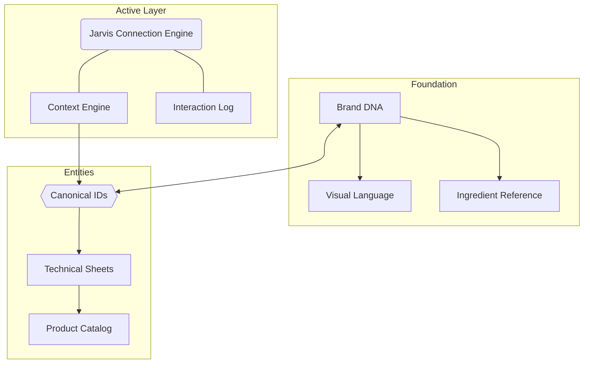

# 🧠 Medicinal Pharma Brain


> **"The science in favor of growth — for your muscles and your business."**

Electronic Second Brain (Obsidian) for **Medicinal Pharma**, a premium sports nutrition brand. This project serves as a high-fidelity knowledge graph, bridge-connecting brand DNA, scientific research, and AI-driven marketing automation.

[](https://obsidian.md/)
[](https://www.anthropic.com/)
[](LICENSE)
[](CONTEXT.md)

---

## 🚀 One-Minute Pitch

This is not just a folder of markdown files. It is an **Active Intelligence Engine**. 

Designed to empower both **Developers** and **Designers**, this vault treats brand information as *code entities*. Every product, ingredient, and persona is a canonical node in a graph that allows an AI assistant (like Claude) to synthesize high-performance marketing content with 100% scientific and brand accuracy.

---

## 🛠 For Developers: The "Jarvis" Architecture

The vault implements a custom proposal for **Autonomous Intelligence Connectivity**. Instead of linear search, we use a graph-based retrieval strategy.

### 🧩 The Data Engine
- **Canonical ID System:** Every entity (product `power-creatine`, persona `nucleo`) has a single source of truth in `System/ids.md`.
- **Taxonomy-Driven:** Strict folder hierarchy ensures a clean ingestion pipeline for new assets.
- **AI-Native Metadata:** Files contain custom frontmatter (`activation_contexts`, `connects_to`, `weight`) to help LLMs calculate contextual relevance in real-time.

### 🔄 The Knowledge Graph (Conceptual)



> [!TIP]
> Check `JARVIS_ARCHITECTURE.md` to see the roadmap for the self-learning loop using MCP (Model Context Protocol).

---

## 🎨 For Designers: Premium Visual DNA

"Medicinal Pharma" isn't just about results; it's about a **Premium Experience**. The vault acts as a Living Style Guide and Content Playground.

### 📐 Visual Standards
- **Primary Palette:** Deep Navy (`#20388a`), Vibrant Red (`#d20a11`), Platinum Red.
- **Typography:** `Montserrat` (Body) & `xBall Italic` (Headings).
- **Core Theme:** *Elite Performance*—visualizing the intersection of raw power and clinical purity.

### 📈 Content Strategy
- **Campaign 01 (Origem da Performance):** Full creative planning focused on the traceability of raw materials (Glanbia, Creapure).
- **Persona-Centric Assets:** Strategic splits between *Nucleus* (Athletes/Affiliates) and *Acquisition* (New members).

---

## 📂 Vault Structure

```bash
Medicinal Pharma Brain/
├── 📁 .claude/             # Agentic protocols
├── 📁 Brand/               # Brand DNA & Product Science
│   ├── brand-core.md       # Root DNA
│   ├── 📁 technical-sheets # High-fidelity product data
│   └── 📁 themes           # UI & Campaign themes
├── 📁 Content/             # Active Marketing Output
│   ├── campaign-01.md      # Launch plans
│   └── issues-log.md       # Quality Assurance
├── 📁 System/              # The "Brain" Logic
│   ├── ids.md              # Canonical dictionary
│   └── taxonomy.md         # Classification rules
├── 📁 Research/            # Market intelligence & Sales Data
└── 🧭 CONTEXT.md           # The Session Root (Source of Truth)
```

---

## 🌟 Key Performance Indicators (Vault Health)

- **Standardization:** 100% Wikilink connectivity.
- **Accuracy:** Scientific validation for ingredient dosages (`Brand/brand-core.md`).
- **Scalability:** Ready for integration with custom Python/Obsidian plugins for automated CSV ingestion.

---

## 🤝 Contact

**Medicinal Pharma oficiais**  
[mpoficial.com](https://mpoficial.com) | [@medicinalpharma](https://instagram.com/medicinalpharma)  
*Quality Makes The Difference.*

---
*Created by [Your Name/Handle], synthesized by Antigravity AI.*
